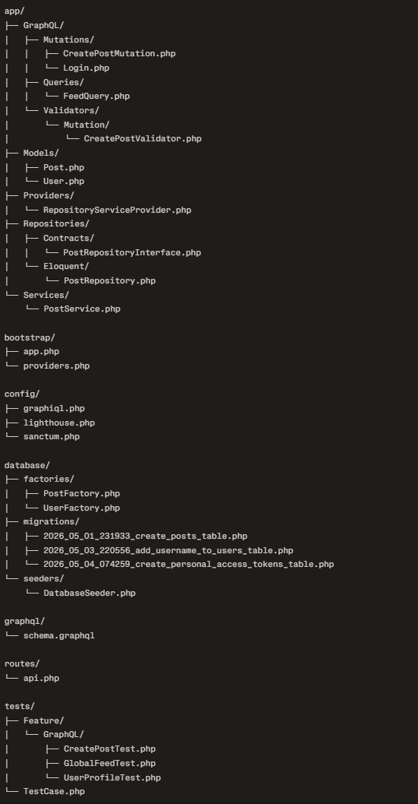

# FeedForge

A backend-only micro-blog GraphQL API built with Laravel 11, PHP 8.2, SQLite, and GraphQL via Lighthouse. The project exposes a small Twitter-like API with a global feed, user profile lookup by username, login, and authenticated post creation. The focus of this assignment is clean Laravel architecture, GraphQL schema design, validation, and efficient relational data fetching.

## Setup

### Option 1: Run with Docker / Laravel Sail

Use this option if Docker is installed and working on your machine.

`git clone https://github.com/nyssLab/FeedForge.git`

`cd FeedForge`

`composer install`

`copy .env.example .env`

`./vendor/bin/sail up -d`

`./vendor/bin/sail artisan key:generate`

`./vendor/bin/sail artisan migrate --seed`

### Option 2: Run locally on Windows without Docker

Use this option if you want to run the project directly on Windows without Docker/Sail.

### Requirements
- Laravel 11 / PHP 8.2+ / Composer / SQLite DB

### Steps

`git clone https://github.com/nyssLab/FeedForge.git`

`cd FeedForge`

`composer install`

`copy .env.example .env`
    
`php artisan key:generate`

`php artisan migrate --seed`

`php artisan serve`


### Check Application is running:
    - GraphQL endpoint: `http://localhost:8088/graphql`
    - GraphQL Playground: `http://localhost:8088/graphiql`

## Architecture

This project uses **Laravel 11** as the application framework and **Lighthouse** as the GraphQL server implementation. Lighthouse was chosen because it integrates naturally with Laravel, keeps the schema declarative, and supports GraphQL queries, mutations, validation, pagination, and relation resolution cleanly.

### Main architectural choices

- **GraphQL API with Lighthouse**
    - GraphQL schema lives in `graphql/schema.graphql`
    - Queries and mutations are resolved through dedicated resolver classes
    - Lighthouse directives are used for schema-driven GraphQL behavior

- **Domain models**
    - `User` and `Post` Eloquent models define the main data relationships
    - A user can have many posts
    - A post belongs to one author

- **Queries**
    - `FeedQuery` handles the global feed query
    - `userProfile` fetches a user by username together with posts

- **Mutations**
    - `Login` handles authentication and token creation
    - `CreatePostMutation` handles authenticated post creation

- **Validation**
    - `CreatePostValidator` centralizes mutation validation rules
    - Post content is validated before persistence

- **Service and repository layers**
    - `PostService` contains post-related business logic
    - `PostRepositoryInterface` and `PostRepository` keep data access separated from GraphQL resolver logic
    - `RepositoryServiceProvider` binds interfaces to implementations for dependency injection

- **Database**
    - SQLite is used for simple local setup and easy project review
    - Migrations define users, posts, and personal access tokens
    - Factories and seeders provide test data out of the box

- **Testing**
    - Feature tests cover the GraphQL API contract:
        - `GlobalFeedTest`
        - `UserProfileTest`
        - `CreatePostTest`

- Relational fetching is kept efficient through Eloquent relationships and GraphQL-aware query design, which is especially important in GraphQL APIs.

### Why this structure?

The project keeps GraphQL entrypoints thin and pushes reusable logic into services and repositories where appropriate. This keeps the schema resolvers readable while still following Laravel best practices such as validation, dependency injection, Eloquent relationships, factories, migrations, and feature testing.

## GraphQL examples

Below are example operations you can run in GraphQL Playground to test the API, which the assignment explicitly asks to provide in the README.

### 1) Global feed

```graphql
query Feed {
  feed(first: 10, page: 1) {
    data {
      id
      body
      created_at
      author {
        id
        username
      }
    }
    paginatorInfo {
      currentPage
      lastPage
      total
    }
  }
}
```

### 2) User profile by username

```graphql
query UserProfile {
  userProfile(username: "testUser") {
    id
    name
    created_at
    posts {
      id
      body
    }
  }
}
```

### 3) Login

```graphql
mutation Login {
  login(email: "test@example.com", password: "password")
}
```

If the login is successful, copy the returned token and add it in the **HTTP HEADERS** tab inside GraphQL Playground:

```json
{
  "Authorization": "Bearer YOUR_ACCESS_TOKEN"
}
```

This header is required for authenticated operations such as creating a post.

### 4) Create post

```graphql
mutation CreatePost {
  createPost(input: { body: "I'm a long post that needs to be at least 20 characters long." }) {
    id
    body
    author {
      id
      username
    }
  }
}
```

## Implemented features

- Fetch a paginated global feed of posts
- Fetch a user profile by username with that user's posts
- Authenticate with login and receive an access token
- Create a post through an authenticated GraphQL mutation
- Validate post creation rules before saving
- Feature tests covering core GraphQL endpoints
- SQLite-based local setup for easy review


## Project Structure




## Performance considerations for 1,000,000+ posts

This project is intentionally small and review-friendly, but it already includes several decisions aimed at keeping the main GraphQL queries efficient as the dataset grows.

### Already implemented

#### 1. Batched relation loading in Lighthouse

Lighthouse relation batch loading is enabled through:

```php
'batchload_relations' => true,
```

This helps reduce GraphQL N+1 query issues when resolving relational fields such as post authors and user posts. Lighthouse can automatically batch relationship resolution for directives like `@belongsTo` and `@hasMany`, which keeps query counts under control without adding much complexity to the codebase.

#### 2. Pagination limits

The API uses pagination on the global feed instead of returning an unbounded list of posts. In addition, `maxCount` is used on paginated GraphQL fields to prevent clients from requesting excessively large pages in a single query.

This protects the API from expensive requests and keeps response size predictable, which becomes increasingly important as the number of rows grows.

#### 3. Eager loading for post authors

The feed query eagerly loads the related author:

```php
->with('author')
```

This avoids issuing one extra query per post when the GraphQL response asks for author data, which is a classic N+1 problem in relational APIs.

#### 4. GraphQL relationship directives

The schema uses Lighthouse relationship directives such as:

- `@belongsTo`
- `@hasMany`

These directives work well with Lighthouse’s batch loader and help resolve related models efficiently. This keeps the schema expressive while still benefiting from optimized relation loading.

#### 5. Explicit relation loading in schema

The feed field is defined with relation-aware GraphQL loading:

```graphql
feed: [Post!]! @paginate @with(relation: "user")
```

Using `@with` ensures related data is eager loaded at the GraphQL layer, reducing unnecessary database round-trips when author information is requested in feed results.

#### 6. Composite indexes for the two main read paths

The database schema includes composite indexes that support the two most important query patterns in the application:

```php
// Global feed: ORDER BY created_at DESC, id DESC
$table->index(['created_at', 'id']);

// User profile: WHERE user_id = ? ORDER BY created_at DESC
$table->index(['user_id', 'created_at']);
```

These indexes are important because they align with the actual access patterns of the application:
- the global feed reads recent posts in chronological order
- the user profile reads one user’s posts ordered by recency

Without those indexes, both queries would become slower as the posts table grows.

### Additional steps I would take at larger scale

If the posts table grew well beyond 1,000,000 rows, the next improvements would be:

#### 1. Use cursor-based pagination for the feed

Offset pagination is simple and works well for this assignment, but for very large datasets I would move the global feed toward cursor-based or keyset pagination based on indexed columns such as `created_at` and `id`.

This avoids expensive deep offsets and keeps later pages fast even when the table becomes very large.

#### 2. Return only required columns

For high-traffic endpoints, I would narrow selected columns to only what is needed for the GraphQL response, instead of always selecting full rows. This reduces I/O and memory usage.

#### 3. Add caching where appropriate

For repeated read-heavy queries, I would consider short-lived caching for popular profile lookups or feed fragments, especially if the same queries are requested frequently.

#### 4. Monitor query plans and slow queries

At larger scale, I would regularly inspect query plans and monitor slow queries to verify that indexes are being used as intended and that new GraphQL fields do not introduce hidden N+1 problems.

### Summary

For this assignment, the main focus was to keep the implementation simple while still addressing the most important scaling concerns early:
- prevent N+1 queries
- paginate aggressively
- eager load relations
- use GraphQL-aware relation loading
- support the main read patterns with appropriate composite indexes


